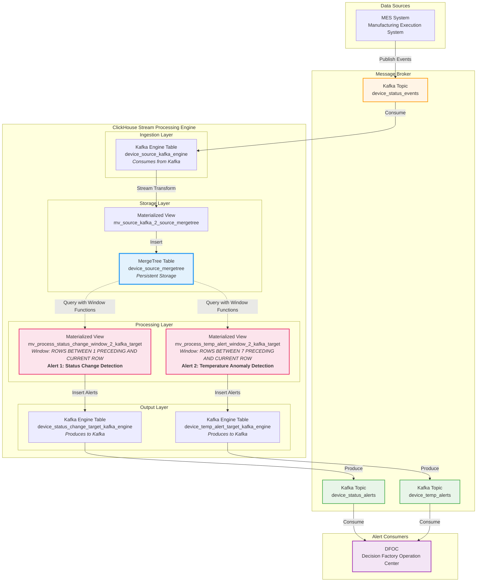

# ClickHouse Kafka Stream Processing for Real-Time Device Monitoring


## Overview

A production-grade proof-of-concept demonstrating **ClickHouse as a stream processing engine** for real-time manufacturing equipment monitoring and alerting. This system addresses critical latency issues in device status change detection by leveraging ClickHouse's Kafka Engine and Materialized Views with window functions.

### Problem Statement

In smart manufacturing environments, delayed detection of equipment status changes can lead to:
- Unplanned downtime going unnoticed
- Delayed response to equipment failures
- Reduced overall equipment effectiveness (OEE)
- Increased maintenance costs

**Challenge**: Traditional approaches using separate stream processors (Flink/Spark) introduce additional complexity and latency.

### Solution

This project implements a **unified stream processing pipeline** using ClickHouse's native capabilities:

```
Kafka (Device Events) → ClickHouse Kafka Engine → Window Functions → Alert Detection → Kafka (Alerts)
```

**Key Innovation**: Zero external stream processor required - ClickHouse handles both storage and real-time computation.

## Architecture

### System Design



**Note**: Conceptual architecture for reference. Does not represent deployment topology.

### Data Flow

#### 1. Ingestion Pipeline
```
Kafka Topic → Kafka Engine (consume) → Materialized View → MergeTree (persist)
```

- **Kafka Engine** acts as a streaming source (ephemeral, no persistence)
- **Materialized View** transforms and routes data to MergeTree
- Captures Kafka metadata timestamp via `_timestamp` virtual column for latency tracking

#### 2. Alert Processing Pipelines

##### Alert 1: Device Status Change Detection

**Business Rule**: Detect when equipment transitions to error state (status code `5000` = Unscheduled Downtime)

**Implementation**:
```sql
-- Window function: compare current vs previous status
groupArray(device_status) OVER (
    PARTITION BY region, product_line, deviceid 
    ORDER BY device_timestamp ASC 
    ROWS BETWEEN 1 PRECEDING AND CURRENT ROW
)
-- Filter: status_flags[1] != status_flags[2] AND status_flags[2] = '5000'
```

**Trigger Condition**: `status[t-1] ≠ status[t] AND status[t] = 5000`

**Average Latency**: ~4 seconds (source Kafka → alert Kafka)

##### Alert 2: Temperature Anomaly Detection

**Business Rule**: Detect temperature deviations exceeding ±5°C from 7-day rolling average, combined with status change

**Implementation**:
```sql
-- Rolling average over 7 rows
avg(temp) OVER (
    PARTITION BY region, product_line, deviceid 
    ORDER BY device_timestamp ASC 
    ROWS BETWEEN 7 PRECEDING AND CURRENT ROW
)
-- Alert condition: temp > (avg + 5) OR temp < (avg - 5)
-- Combined with status change detection
```

**Trigger Condition**: 
- `|temp[t] - avg(temp[t-7:t])| > 5°C`
- AND `status[t-1] ≠ status[t]`

**Average Latency**: ~5 seconds (source Kafka → alert Kafka)

#### 3. Alert Publishing
```
Materialized View → Kafka Engine (produce) → Kafka Topic → DFOC
```

- Alerts written to Kafka Engine tables are automatically published
- Format: `JSONEachRow`
- DFOC (Decision Factory Operation Center) consumes alerts for notification and remediation

## Technical Implementation

### Core Technologies

| Component | Technology | Purpose |
|-----------|-----------|---------|
| **Message Broker** | Apache Kafka | Event streaming and alert distribution |
| **Stream Processor** | ClickHouse Kafka Engine | Bidirectional Kafka integration |
| **Storage Engine** | ClickHouse MergeTree | High-performance analytical storage |
| **Computation** | SQL Window Functions | Stateful stream processing |
| **Data Generator** | Python + confluent-kafka | Testing and simulation |

### ClickHouse Kafka Engine

#### How It Works

- **Consumer Mode**: Continuously polls Kafka, exposes messages as table rows (ephemeral)
- **Producer Mode**: Inserts to the table are published to Kafka
- **No Data Persistence**: Kafka Engine tables do not store data in ClickHouse
- **Virtual Columns**: Access to Kafka metadata (`_topic`, `_partition`, `_offset`, `_timestamp`)

#### Configuration

```sql
ENGINE = Kafka
SETTINGS 
    kafka_broker_list = 'localhost:9092',
    kafka_topic_list = 'device_status_events',
    kafka_group_name = 'clickhouse_consumer',
    kafka_format = 'JSONEachRow',
    kafka_flush_interval_ms = 5000
```

### Window Functions for Stream Processing

#### Status Change Detection (2-Row Window)

```sql
CREATE MATERIALIZED VIEW mv_process_status_change_window_2_kafka_target
TO device_status_change_target_kafka_engine AS
SELECT * FROM (
    SELECT
        source_kafka_timestamp,
        unique_id,
        region,
        product_line,
        deviceid,
        device_timestamp,
        arrayMap(x -> toString(x), groupArray(device_status) OVER w2) AS status_flags,
        errcode,
        toDateTime64(now(), 6) AS process_detected_time
    FROM device_source_mergetree
    WINDOW w2 AS (
        PARTITION BY region, product_line, deviceid 
        ORDER BY device_timestamp ASC 
        ROWS BETWEEN 1 PRECEDING AND CURRENT ROW
    )
)
WHERE LENGTH(status_flags) = 2
  AND status_flags[1] != status_flags[2] 
  AND status_flags[2] = '5000';
```

**Key Concepts**:
- `PARTITION BY`: Separate window per device
- `ORDER BY device_timestamp`: Chronological ordering
- `ROWS BETWEEN 1 PRECEDING AND CURRENT ROW`: 2-row sliding window
- `groupArray()`: Collect values into array `[previous, current]`
- `WHERE` clause: Filter for status changes to error state

#### Temperature Anomaly Detection (8-Row Window)

```sql
CREATE MATERIALIZED VIEW mv_process_temp_alert_window_2_kafka_target
TO device_temp_alert_target_kafka_engine AS
SELECT * FROM (
    SELECT
        source_kafka_timestamp,
        unique_id,
        region,
        product_line,
        deviceid,
        device_timestamp,
        temp,
        avg(temp) OVER w1 AS weekly_avg_temp,
        arrayMap(x -> toString(x), groupArray(device_status) OVER w2) AS status_flags,
        multiIf(
            temp > (avg(temp) OVER w1 + 5), 'High Alert',
            temp < (avg(temp) OVER w1 - 5), 'Low Alert',
            'Normal'
        ) AS temp_alert,
        errcode,
        toDateTime64(now(), 6) AS process_detected_time
    FROM device_source_mergetree
    WINDOW
        w1 AS (
            PARTITION BY region, product_line, deviceid 
            ORDER BY device_timestamp ASC 
            ROWS BETWEEN 7 PRECEDING AND CURRENT ROW
        ),
        w2 AS (
            PARTITION BY region, product_line, deviceid 
            ORDER BY device_timestamp ASC 
            ROWS BETWEEN 1 PRECEDING AND CURRENT ROW
        )
)
WHERE LENGTH(status_flags) = 2
  AND status_flags[1] != status_flags[2]
  AND temp_alert = 'High Alert';
```

**Key Concepts**:
- **Multiple Windows**: `w1` for temperature averaging, `w2` for status change
- **8-Row Window**: `ROWS BETWEEN 7 PRECEDING AND CURRENT ROW` = 8 total rows
- **Conditional Logic**: `multiIf()` for alert classification
- **Combined Conditions**: Temperature anomaly AND status change

### Performance Characteristics

#### Measured Latency

| Metric | Alert 1 (Status Change) | Alert 2 (Temperature) |
|--------|------------------------|----------------------|
| **Average End-to-End Latency** | ~4 seconds | ~5 seconds |
| **Measurement** | Source Kafka timestamp → Target Kafka timestamp | Source Kafka timestamp → Target Kafka timestamp |
| **Test Load** | 10 devices × 100 events each | 10 devices × 100 events each |

#### Latency Tracking Implementation

```sql
-- Latency measurement table
CREATE TABLE kafka_status_latency (
    topic String,
    unique_id String,
    device_timestamp DateTime64(6),
    source_kafka_timestamp DateTime64(6),
    process_detected_time DateTime64(6),
    target_kafka_timestamp DateTime64(6),
    msg_latency Float64  -- Microseconds
) ENGINE = MergeTree()
ORDER BY (unique_id, target_kafka_timestamp);

-- Automatic latency calculation
CREATE MATERIALIZED VIEW mv_kafka_status_latency
TO kafka_status_latency AS
SELECT
    _topic AS topic,
    unique_id,
    device_timestamp,
    source_kafka_timestamp,
    process_detected_time,
    toDateTime64(_timestamp, 6) AS target_kafka_timestamp,
    toUnixTimestamp64Micro(toDateTime64(_timestamp, 6)) - 
    toUnixTimestamp64Micro(source_kafka_timestamp) AS msg_latency
FROM device_status_change_target_kafka_engine;
```

#### Advantages vs Traditional Stream Processors

| Aspect | ClickHouse Approach | Traditional (Flink/Spark) |
|--------|-------------------|--------------------------|
| **Architecture Complexity** | Single system | Multiple systems (storage + processor) |
| **Operational Overhead** | Low (one cluster) | High (multiple clusters) |
| **Query Language** | SQL (familiar) | Custom APIs or SQL-like |
| **Latency** | Sub-second to seconds | Sub-second to seconds |
| **Storage Integration** | Native (same system) | External (separate database) |
| **Learning Curve** | Low (SQL knowledge) | High (framework-specific) |

#### Limitations

- **Stateful Operations**: Limited compared to dedicated stream processors
- **Exactly-Once Semantics**: Not guaranteed (at-least-once delivery)
- **Complex Event Processing**: Better suited for simpler transformations
- **Backpressure**: Limited handling compared to Flink/Spark

## Data Model

### Device Status Codes

```python
device_status_map = {
    1000: "PRD",  # Production
    2000: "SBY",  # Standby
    3000: "ENG",  # Engineering
    4000: "SDT",  # Scheduled Downtime
    5000: "USD",  # Unscheduled Downtime (ERROR STATE)
}
```

### Message Schema

#### Input (Kafka Source Topic)

```json
{
  "unique_id": "550e8400-e29b-41d4-a716-446655440000",
  "region": "North",
  "product_line": "Line_A",
  "message_name": "device_status_update",
  "deviceid": "device_1",
  "device_status": 1000,
  "errcode": null,
  "temp": 75.5,
  "pressure": 950.2,
  "device_timestamp": "2024-01-01 12:00:00.000000"
}
```

#### Output (Alert Topics)

**Status Change Alert**:
```json
{
  "source_kafka_timestamp": "2024-01-01 12:00:00.000000",
  "unique_id": "550e8400-e29b-41d4-a716-446655440000",
  "region": "North",
  "product_line": "Line_A",
  "deviceid": "device_1",
  "device_timestamp": "2024-01-01 12:00:00.000000",
  "status_flags": [2000, 5000],
  "errcode": "ERR_100",
  "process_detected_time": "2024-01-01 12:00:04.000000"
}
```

**Temperature Alert**:
```json
{
  "source_kafka_timestamp": "2024-01-01 12:00:00.000000",
  "unique_id": "550e8400-e29b-41d4-a716-446655440000",
  "region": "North",
  "product_line": "Line_A",
  "deviceid": "device_1",
  "device_timestamp": "2024-01-01 12:00:00.000000",
  "temp": 85.5,
  "weekly_avg_temp": 75.0,
  "status_flags": [1000, 2000],
  "temp_alert": "High Alert",
  "errcode": null,
  "process_detected_time": "2024-01-01 12:00:05.000000"
}
```

## Repository Structure

```
clickhouse-kafka-stream-alerts/
├── .env.example                    # Environment variable template
├── .gitignore                      # Git ignore rules
├── LICENSE                         # MIT License
├── README.md                       # This file
├── requirements.txt                # Python dependencies
├── main.py                         # Entry point (reference)
└── kafka_clickhouse_alert_project/
    ├── generate_fake_data.py       # Test data generator
    ├── kafka_message.py            # Kafka consumer utility
    ├── setup_clickhouse.py         # ClickHouse schema initialization
    ├── src/
    │   └── config.py               # Configuration management
    └── sql/                        # ClickHouse DDL scripts
        ├── 01_create_kafka_source_table.sql
        ├── 02_create_mergetree_storage_table.sql
        ├── 03_create_materialized_view.sql
        ├── 04_create_target_kafka_table.sql
        ├── 04_1_create_target_temp_kafka_table.sql
        ├── 05_compute_status_change_window.sql
        └── 05_1_compute_status_change_window_temp.sql
```

## Getting Started

### Prerequisites

- **Apache Kafka**: Running broker (tested with latest version)
- **ClickHouse**: Server instance (tested with latest version)
- **Python 3.x**: For data generation and utilities

### Installation

1. **Clone the repository**:
   ```bash
   git clone https://github.com/Han-lai/clickhouse-kafka-stream-alerts.git
   cd clickhouse-kafka-stream-alerts
   ```

2. **Install Python dependencies**:
   ```bash
   pip install -r requirements.txt
   ```

3. **Configure environment variables**:
   ```bash
   cp .env.example .env
   # Edit .env with your Kafka and ClickHouse connection details
   ```

### Setup

1. **Create Kafka topics**:
   ```bash
   # Source topic
   kafka-topics --create --topic device_status_events \
     --bootstrap-server localhost:9092 \
     --partitions 3 --replication-factor 1
   
   # Alert topics
   kafka-topics --create --topic device_status_alerts \
     --bootstrap-server localhost:9092 \
     --partitions 3 --replication-factor 1
   
   kafka-topics --create --topic device_temp_alerts \
     --bootstrap-server localhost:9092 \
     --partitions 3 --replication-factor 1
   ```

2. **Initialize ClickHouse schema**:
   ```bash
   cd kafka_clickhouse_alert_project
   python setup_clickhouse.py
   ```

3. **Generate test data**:
   ```bash
   python generate_fake_data.py
   ```

4. **Monitor alerts**:
   ```bash
   # Status change alerts
   kafka-console-consumer --topic device_status_alerts \
     --bootstrap-server localhost:9092 --from-beginning
   
   # Temperature alerts
   kafka-console-consumer --topic device_temp_alerts \
     --bootstrap-server localhost:9092 --from-beginning
   ```

### Configuration

Edit `kafka_clickhouse_alert_project/src/config.py` or set environment variables:

```python
# Kafka Configuration
KAFKA_BROKER = os.getenv('KAFKA_BROKER', 'localhost:9092')
KAFKA_SOURCE_TOPIC = os.getenv('KAFKA_SOURCE_TOPIC', 'device_status_events')
KAFKA_STATUS_TOPIC = os.getenv('KAFKA_STATUS_TOPIC', 'device_status_alerts')
KAFKA_TEMP_TOPIC = os.getenv('KAFKA_TEMP_TOPIC', 'device_temp_alerts')

# ClickHouse Configuration
CLICKHOUSE_HOST = os.getenv('CLICKHOUSE_HOST', 'localhost')
CLICKHOUSE_PORT = os.getenv('CLICKHOUSE_PORT', '9000')
CLICKHOUSE_USER = os.getenv('CLICKHOUSE_USER', 'default')
CLICKHOUSE_PASSWORD = os.getenv('CLICKHOUSE_PASSWORD', 'your_password')
CLICKHOUSE_DATABASE = os.getenv('CLICKHOUSE_DATABASE', 'device_monitoring')
```

## Use Cases

### Manufacturing Equipment Monitoring

- **Real-time OEE tracking**: Monitor equipment effectiveness in real-time
- **Predictive maintenance**: Detect anomalies before failures occur
- **Production line optimization**: Identify bottlenecks and inefficiencies

### Alert Scenarios

| Alert Type | Trigger Condition | Use Case |
|-----------|------------------|----------|
| **Status Change** | Device transitions to error state (5000) | Immediate notification for unplanned downtime |
| **Temperature Anomaly** | Temperature exceeds ±5°C from 7-day average + status change | Early warning for equipment overheating or cooling issues |
| **Custom Rules** | Extensible via SQL WHERE clauses | Domain-specific alert logic |

## Design Evolution

This project went through several design iterations:

### Initial Approach: ReplacingMergeTree + LAG()
- Used `ReplacingMergeTree` to keep only latest device state
- Applied `LAG()` function to compare with previous state
- **Issue**: Complexity in handling multiple devices and time windows

### Final Approach: Window Functions + Materialized Views
- Leveraged ClickHouse window functions for stateful computation
- Separate materialized views for different alert types
- **Advantage**: Cleaner separation of concerns, easier to extend

### Key Learnings

1. **Window Functions are Powerful**: ClickHouse's window functions provide sufficient capability for many stream processing use cases
2. **Materialized Views for Routing**: Use MVs to route data to different destinations based on conditions
3. **Latency Tracking is Critical**: Built-in latency measurement helps identify bottlenecks
4. **SQL is Sufficient**: No need for complex stream processing frameworks for many real-world scenarios

## Limitations & Considerations

### Known Limitations

1. **No Exactly-Once Semantics**: ClickHouse Kafka Engine provides at-least-once delivery
2. **Limited Backpressure Handling**: May struggle with extreme burst traffic
3. **Synchronous Processing**: Materialized View execution blocks Kafka consumption
4. **Window State Management**: Limited compared to Flink/Spark for complex stateful operations

### When NOT to Use This Approach

- **Complex Event Processing**: Multi-step workflows with complex state machines
- **Exactly-Once Requirements**: Financial transactions or critical data pipelines
- **Very High Throughput**: Millions of events per second per topic
- **Long-Running Windows**: Windows spanning hours or days (use batch processing instead)

### When This Approach Excels

- **Moderate Throughput**: Thousands to tens of thousands of events per second
- **Simple to Medium Complexity**: Status changes, threshold alerts, rolling aggregations
- **SQL-Savvy Teams**: Leverage existing SQL knowledge
- **Unified Stack**: Reduce operational complexity by using one system

## Monitoring & Operations

### Key Metrics to Monitor

1. **Kafka Consumer Lag**: Monitor `kafka_clickhouse_alert_project` consumer group lag
2. **ClickHouse Query Performance**: Track materialized view execution time
3. **Alert Latency**: Monitor end-to-end latency using latency tracking tables
4. **Data Completeness**: Verify no data loss between Kafka and ClickHouse

### Troubleshooting

**Issue**: High consumer lag
- **Solution**: Increase Kafka Engine `kafka_num_consumers` setting
- **Solution**: Optimize materialized view queries

**Issue**: Alerts not triggering
- **Solution**: Verify window function logic with manual queries
- **Solution**: Check Kafka Engine table is consuming messages

**Issue**: High latency
- **Solution**: Review ClickHouse server resources (CPU, memory, disk I/O)
- **Solution**: Optimize MergeTree table partitioning and ordering keys

## Future Enhancements

Potential improvements for production deployment:

- [ ] Add exactly-once semantics using external state management
- [ ] Implement alert deduplication logic
- [ ] Add alert severity levels and escalation rules
- [ ] Integrate with monitoring systems (Prometheus, Grafana)
- [ ] Add automated testing for alert logic
- [ ] Implement alert acknowledgment and resolution tracking
- [ ] Add support for custom alert rules via configuration
- [ ] Implement alert rate limiting to prevent alert storms

## Related Projects

This project is part of a series exploring ClickHouse for stream processing:

- **RabbitMQ → Kafka → Kafka via ClickHouse**: Earlier experiment with RabbitMQ integration
- **DFOC Equipment Monitoring**: Production deployment for manufacturing equipment monitoring

## Contributing

This is an archived project and is not actively maintained. However, feel free to fork and adapt for your own use cases.

## License

This project is licensed under the MIT License - see the [LICENSE](LICENSE) file for details.

Copyright (c) 2024 Lai,shi-han

## Acknowledgments

- **ClickHouse Team**: For building an amazing analytical database with stream processing capabilities
- **Apache Kafka**: For providing a robust message broker
- **Manufacturing Team**: For providing real-world use cases and requirements

---

**Disclaimer**: This is a proof-of-concept project preserved for reference. It demonstrates technical feasibility but is not production-ready. Use at your own risk and adapt to your specific requirements.

## Contact & Support

For questions or discussions about this project:
- **GitHub Issues**: [Create an issue](https://github.com/Han-lai/clickhouse-kafka-stream-alerts/issues)
- **Repository**: [clickhouse-kafka-stream-alerts](https://github.com/Han-lai/clickhouse-kafka-stream-alerts)

---

**Built with** ❤️ **for the data engineering community**
