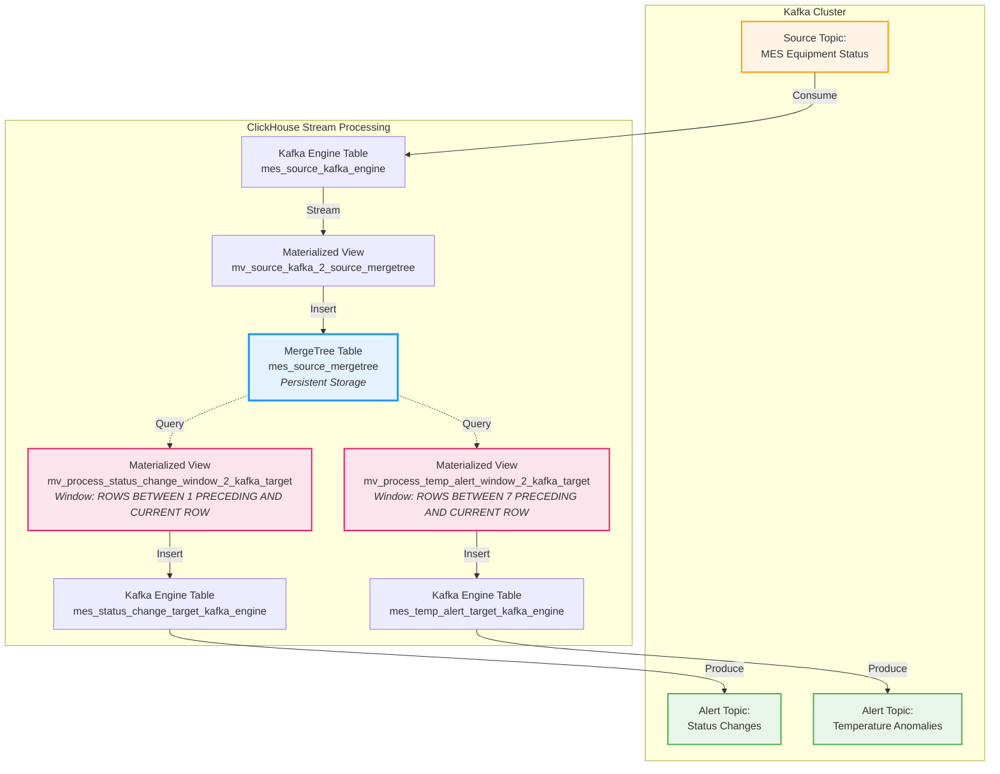

# Kafka-ClickHouse Real-Time Alert System

## What is this

A technical proof-of-concept demonstrating **ClickHouse Kafka Engine** for real-time stream processing and alerting. This system implements a complete data pipeline:

1. **Ingestion**: Consumes device telemetry from Kafka using ClickHouse Kafka Engine tables
2. **Storage**: Persists data to MergeTree tables via Materialized Views
3. **Stream Processing**: Applies window functions for real-time anomaly detection
4. **Alert Publishing**: Writes computed alerts back to Kafka topics

**Key Technical Features:**
- Zero external stream processor (no Flink/Spark) - ClickHouse handles all processing
- SQL-based window functions for stateful computations
- Bidirectional Kafka integration (consume + produce)
- Sub-second latency for alert detection

## What this is NOT

- Not a production-ready system (lacks error handling, monitoring, HA)
- Not actively maintained or under development
- Not a complete observability solution
- Not optimized for scale or deployment

## Background / Motivation

This project was created to evaluate **ClickHouse as a stream processing engine** for manufacturing equipment monitoring. The use case involves:

- **Domain**: Manufacturing Execution System (MES) integration
- **Data Source**: Equipment status events from production lines
- **Requirements**: Real-time detection of equipment failures and temperature anomalies
- **Technical Goal**: Assess ClickHouse Kafka Engine performance vs traditional stream processors

The specific business context is no longer available.

## Architecture

### Data Flow Diagram



**Note:** Conceptual diagram for reference only. Does not represent deployment topology.

### Processing Logic

#### 1. Ingestion Pipeline
```
Kafka Topic → Kafka Engine (consume) → Materialized View → MergeTree (persist)
```
- **Kafka Engine** acts as a streaming source (no data persistence in ClickHouse)
- **Materialized View** transforms and routes data to MergeTree
- Captures Kafka metadata timestamp via `_timestamp` virtual column

#### 2. Status Change Detection
```sql
-- Window function: compare current vs previous status
groupArray(device_status) OVER (
    PARTITION BY region, product_line, deviceid 
    ORDER BY device_timestamp ASC 
    ROWS BETWEEN 1 PRECEDING AND CURRENT ROW
)
-- Filter: status_flags[1] != status_flags[2] AND status_flags[2] = '5000'
```
**Logic**: Detects transitions to error state (`5000` = USD - Unscheduled Downtime)

#### 3. Temperature Anomaly Detection
```sql
-- Rolling average over 7 rows
avg(temp) OVER (
    PARTITION BY region, product_line, deviceid 
    ORDER BY device_timestamp ASC 
    ROWS BETWEEN 7 PRECEDING AND CURRENT ROW
)
-- Alert condition: temp > (avg + 5) OR temp < (avg - 5)
```
**Logic**: Flags temperature deviations >±5 units from rolling average

#### 4. Alert Publishing
```
Materialized View → Kafka Engine (produce) → Kafka Topic
```
- Alerts written to Kafka Engine tables are automatically published
- Format: `JSONEachRow`

## ClickHouse Kafka Engine: Technical Notes

### How It Works
- **Kafka Engine** is a special table engine that acts as a Kafka consumer/producer
- **Consumer Mode**: Continuously polls Kafka, exposes messages as table rows (ephemeral)
- **Producer Mode**: Inserts to the table are published to Kafka
- **No Data Persistence**: Kafka Engine tables do not store data in ClickHouse

### Configuration Parameters
```sql
ENGINE = Kafka
SETTINGS 
    kafka_broker_list = 'localhost:9092',
    kafka_topic_list = 'topic_name',
    kafka_group_name = 'consumer_group',
    kafka_format = 'JSONEachRow',
    kafka_flush_interval_ms = 5000
```

### Performance Characteristics (Observed)
- **Throughput**: Suitable for moderate event rates (tested with 10 devices × 100 events)
- **Latency**: Sub-second for simple transformations + window functions
- **Limitations**:
  - No exactly-once semantics (at-least-once delivery)
  - Limited backpressure handling
  - Materialized View execution is synchronous with Kafka consumption

### Advantages vs Traditional Stream Processors
- **Simplicity**: No separate Flink/Spark cluster required
- **SQL-Native**: Familiar syntax for analytics teams
- **Unified Stack**: Single system for storage + processing

### Limitations
- Not designed for complex stateful operations (e.g., sessionization)
- Limited fault tolerance compared to dedicated stream processors
- Kafka Engine tables cannot be queried directly (data is transient)

## Repository Structure

```
kafka_clickhouse_alert_project/
├── sql/                                          # ClickHouse DDL scripts
│   ├── 01_create_kafka_source_table.sql          # Kafka Engine: source consumer
│   ├── 02_create_mergetree_storage_table.sql     # MergeTree: persistent storage
│   ├── 03_create_materialized_view.sql           # MV: Kafka → MergeTree
│   ├── 04_create_target_kafka_table.sql          # Kafka Engine: status alert producer
│   ├── 04_1_create_target_temp_kafka_table.sql   # Kafka Engine: temp alert producer
│   ├── 05_compute_status_change_window.sql       # MV: status change detection logic
│   └── 05_1_compute_status_change_window_temp.sql # MV: temperature alert logic
├── src/
│   └── config.py                                 # Centralized configuration
├── generate_fake_data.py                         # Test data generator (10 devices, 100 events each)
├── kafka_message.py                              # Kafka consumer utility (debugging)
├── setup_clickhouse.py                           # Schema initialization script
└── setup_ch.py                                   # (Unused/duplicate)

main.py                                           # Entry point (incomplete)
setup_materialized_view.sql                       # (Orphaned file)
dfocvenv/                                         # Python virtual environment (excluded)
```

## Scope

### Included
- ClickHouse schema setup (7 SQL files executed in sequence)
- Kafka consumer/producer using `confluent-kafka-python`
- Fake data generator with realistic device status codes
- Window function-based anomaly detection

### Not Included
- Deployment automation (Docker, Kubernetes, etc.)
- Error handling or retry logic
- Monitoring/alerting for the pipeline itself
- Unit or integration tests
- Consumer lag monitoring
- Schema evolution handling

## Tech Stack

| Component | Technology | Version/Notes |
|-----------|-----------|---------------|
| **Stream Broker** | Apache Kafka | Tested with single broker |
| **Stream Processor** | ClickHouse Kafka Engine | Acts as both consumer and producer |
| **Storage** | ClickHouse MergeTree | Ordered by `(region, product_line, deviceid, device_timestamp)` |
| **Client Library** | `confluent-kafka-python` | For data generation |
| **Driver** | `clickhouse-driver` | For schema setup |
| **Language** | Python 3.x | No version pinning |

## Data Model

### Device Status Codes
```python
1000: "PRD"  # Production
2000: "SBY"  # Standby
3000: "ENG"  # Engineering
4000: "SDT"  # Scheduled Downtime
5000: "USD"  # Unscheduled Downtime (ERROR STATE)
```

### Message Schema
```json
{
  "unique_id": "uuid",
  "region": "North|South|East|West",
  "product_line": "Line_A|Line_B|Line_C",
  "message_name": "device_status_update",
  "deviceid": "device_1",
  "device_status": 1000,
  "errcode": "ERR_100",
  "temp": 75.5,
  "pressure": 950.2,
  "device_timestamp": "2024-01-01 12:00:00.000000"
}
```

## Setup Instructions (Historical Reference)

**Note**: These instructions reflect the original setup. Actual execution may require adjustments.

1. **Start Kafka** (configure your Kafka broker address in `config.py`)
2. **Create Kafka topics**:
   ```bash
   # Source topic
   kafka-topics --create --topic device_status_events
   
   # Alert topics
   kafka-topics --create --topic device_status_alerts
   kafka-topics --create --topic device_temp_alerts
   ```
3. **Initialize ClickHouse schema**:
   ```bash
   cd kafka_clickhouse_alert_project
   python setup_clickhouse.py
   ```
4. **Generate test data**:
   ```bash
   python generate_fake_data.py
   ```
5. **Monitor alerts** (consume from alert topics):
   ```bash
   kafka-console-consumer --topic device_status_alerts --from-beginning
   kafka-console-consumer --topic device_temp_alerts --from-beginning
   ```

## Repository Status

- **Status**: Archived / Historical
- **Maintenance**: None
- **Last Activity**: Unknown (legacy project)
- **Purpose**: Technical reference only

## Known Issues & Limitations

1. **Hard-coded credentials**: `config.py` uses default ClickHouse credentials
2. **Internal IPs**: Kafka/ClickHouse addresses are environment-specific
3. **No error handling**: Pipeline failures are not handled gracefully
4. **Incomplete entry point**: `main.py` does not reflect actual usage
5. **Missing dependencies file**: No `requirements.txt` or `pyproject.toml`
6. **Orphaned files**: `gen_fake_data.py`, `setup_ch.py`, `setup_materialized_view.sql` appear unused

## Security Checklist (Pre-Publication)

Before publishing to GitHub, manually verify:

- [x] **Hard-coded credentials** in `src/config.py` - SANITIZED (now uses environment variables)
- [x] **Internal IP addresses** - SANITIZED (replaced with localhost/placeholders)
- [x] **Company-specific topic names** - SANITIZED (replaced with generic names)
- [x] **Database name** - SANITIZED (replaced with generic name)
- [x] **Commented code** with internal references - REMOVED
- [ ] **Log files** (`setup_clickhouse.log`) - Review and exclude from git
- [ ] **Virtual environment** (`dfocvenv/`) - Ensure in `.gitignore`

## License

(No license specified - add before publication)

---

**Disclaimer**: This is a historical project preserved for reference. It is not maintained and should not be used in production environments.
